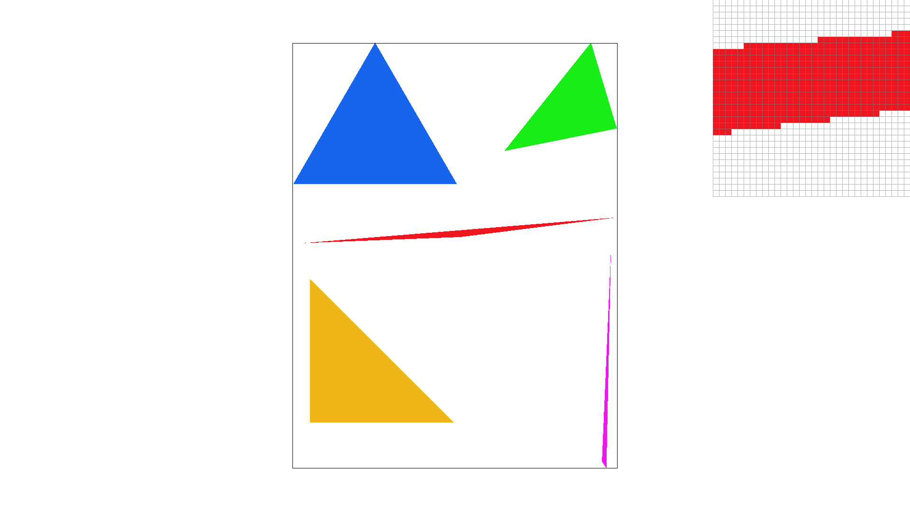
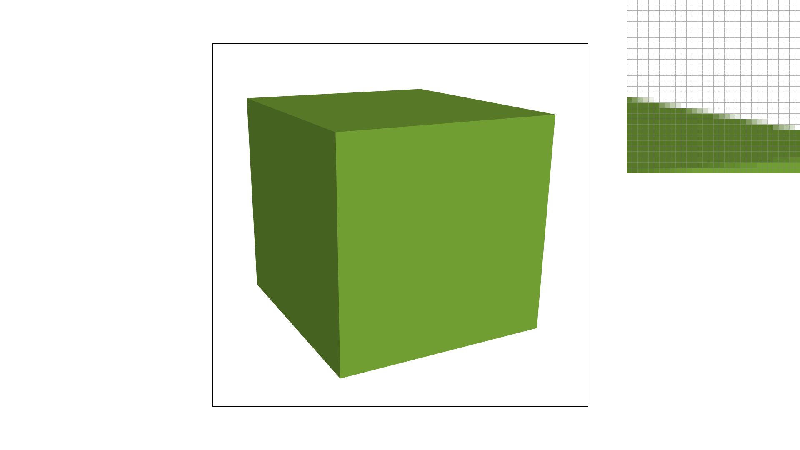

# Task 2: Antialiasing by supersampling

## The problem and the solution

The goal of this task was to improve the render quality of images. 
To be more specific, there is a typical artifact that arises as a result of the way the previous task was implemented, which is that the resulting picture can look quite jagged in certain spots.
This happens because there is a sharp cutoff between full solid-color triangle and the completely blank triangle; conceptually, one pixel may be contained within a triangle but a neighboring pixel may be outside of it.
These pixels have two entirely different colors as a result, and especially because the grid isn't necessarily aligned to the sides of the triangles, the resulting image ends up with "jaggies," where the edges of the triangle end up looking, well, jagged.
There are other possible issues from the naive approach as well, but this visual artifact and a couple of others with similar causes and results are generally grouped together and called *aliasing*.

One way to limit/prevent aliasing (reasonably called *antialiasing*) is to *supersample*, which involves checking multiple points within a particular pixel for containment inside the triangle.
Then, you would take a weighted average of the background color and the color of the triangle, depending on how many of those multiple sample points are actually in the triangle.
This makes the cutoff at the edges a lot less sharp, which reduces the jagged look of the edges.

## How to supersample

In order to accomplish this, several changes had to be made to the code.
The specific type of supersampling used was *grid supersampling*, where the sample points within the pixel form a square grid of points equally spaced throughout the pixel.
This is the simplest method of supersampling; more advanced methods like *jittering* can reduce jaggedness even further by slightly displacing points off of the grid, to get rid of regular patterns that can cause aliasing to occur in some edge cases (no pun intended!).

The first notable change that would be necessary was expanding the size of the sample buffer based on the given sample rate (note that the sample rate is always a square integer, so that the grid of samples in a given pixel is always \\(n\\)x\\(n\\) for some positive integer \\(n\\)).
Since multiple samples are taken per pixel, it becomes necessary to allocate more memory to store all of these pixels.
Also, we're also introducing new structure to the sample buffer, and it's important to think about how we want our supersamples to be stored.
I chose to group the grid of each pixel's sample points together; so the first \\(3n^2\\) entries in the grid corresponded to the pixel at \\((0,0)\\) (the 3 comes from the fact there are 3 color channels, red/green/blue).
Then, each of these pixels is arranged in row major format (so the next pixel is (0,1), then (0,2), then so on up to (0, height), then (1,0)).
This made sense to me as I was iterating over each pixel in the grid, then computing the value of the sample points at each pixel[^1].

Because of the changes to the sample buffer, I had to change how the sample buffer was resolved to the frame buffer. 
In the previous task, the sample buffer was essentially identical to the frame buffer, so it could be essentially copied over to it.
However, now that there are multiple samples per buffer, some averaging work had to be done before the samples could be written to the frame buffer, but nothing too complicated to code.

## The output
These are several renders of two different svgs, one with several colored triangles and another with a cube.
On the top right of the images is a pixel viewer. 
The pixel viewers are aimed at the edges of the drawn triangles, so that the antialiasing effect can be better seen.
The main difference is that the slower drop-off in color allows the edge to be rendered more faithfully, and prevents edges that cut across the border of pixels in odd ways from instead looking like jagged staircases (as the containment computation varies in a strange way relative to the grid).
### 1 sample per pixel

### 4 samples per pixel

### 16 samples per pixel

The pixel viewer here points at the top right edge of the cube. 
### 1 sample per pixel

### 4 samples per pixel

### 16 samples per pixel

## Footnotes

[^1]: This would help optimize cache spatial locality, since the data for supersample points of the same pixel would be accessed consecutively.
    However, I later optimized my code to iterate over the whole grid of supersample points in row major order, as this allowed me to save effort on computation by doing part of the point contaiment calculation before knowing the y-value.
    At this point, it would be more optimal to restructure the sample buffer in the same way, so that cache locality would be optimized and there would have been a small speedup.
    It would also be necessary to restructure the resolution to the frame buffer, to similarly take advantage of cache locality. 
    Unfortunately, I didn't have the time for this, but it's something I want to return to later. 