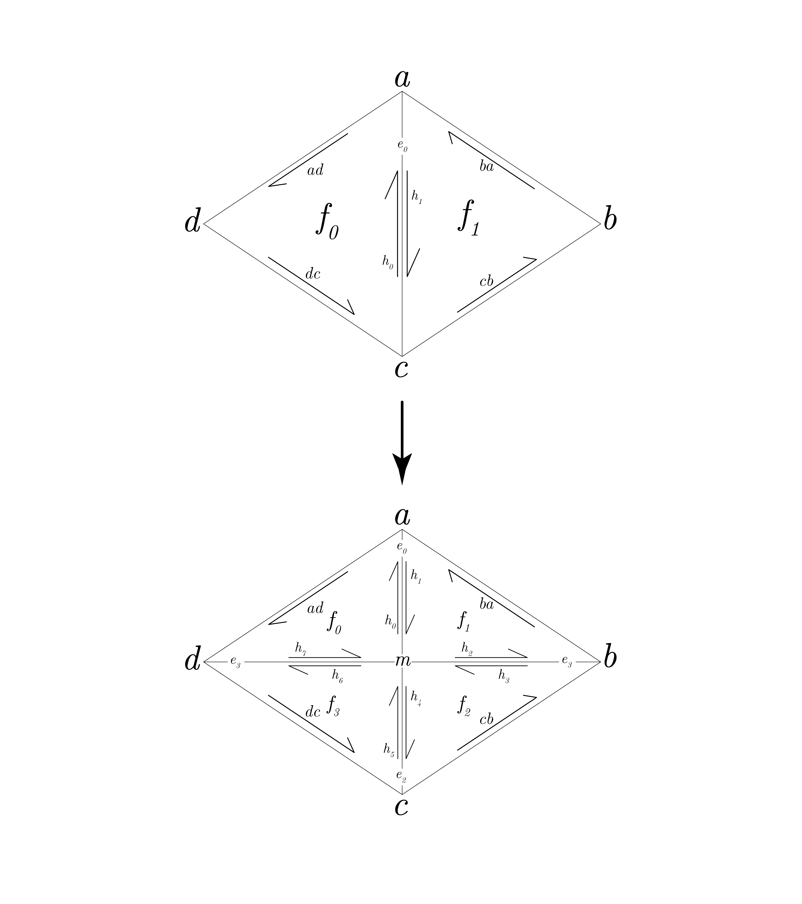
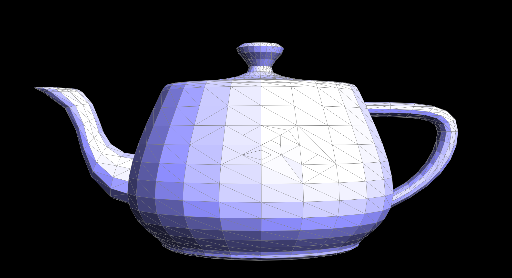

[Back to main page]({{site.baseurl}}/meshedit)
# Task 5: Edge split
## The Theory

To split an edge, we drew the following diagram on a whiteboard and stared at it for 20 minutes:

	

Then, we created the new elements needed, namely \\(m, h_2, h_3, h_4, h_5, h_6, h_7, e_1, e_2, e_3, f_2,\\) and \\(f_3\\). After that, we began the long list of pointer assignments:

- Faces
	- In order, \\(h_1\\), \\(h_2\\), and \\(ba\\) form a face (i.e. \\(h_1\\)'s next halfedge is \\(h_2\\), and so on), and \\(f_1\\)'s halfedge was assigned to one of these 3
	- \\(h_3\\), \\(h_4\\), and \\(cb\\) form a face, and \\(f_2\\)'s halfedge was assigned to one of these 3
	- \\(h_5\\), \\(h_6\\), and \\(dc\\) form a face, and \\(f_3\\)'s halfedge was assigned to one of these 3
	- \\(h_7\\), \\(h_0\\), and \\(ad\\) form a face, and \\(f_0\\)'s halfedge was assigned to one of these 3
- Edges
	- \\(h_0\\) and \\(h_1\\) make up \\(e_0\\), and \\(e_0\\)'s halfedge was assigned to one of these 2
	- \\(h_2\\) and \\(h_3\\) make up \\(e_1\\), and \\(e_1\\)'s halfedge was assigned to one of these 2
	- \\(h_4\\) and \\(h_5\\) make up \\(e_2\\), and \\(e_2\\)'s halfedge was assigned to one of these 2
	- \\(h_6\\) and \\(h_7\\) make up \\(e_3\\), and \\(e_3\\)'s halfedge was assigned to one of these 2
- Vertices
	- \\(m\\)'s halfedge was assigned to \\(h_0\\)
	- Other vertices had no halfedge changes
	- Halfedges \\(h_0, h_2, h_4, h_6\\) were assigned the vertex \\(m\\)
	- Halfedges \\(h_1, h_3, h_5, h_7\\) were assigned the vertices \\(a,b,c,d\\), respectively
- Halfedges 
	- Lastly, we twinned the halfedges: 
	- \\(h_0\\) and \\(h_1\\) are twins
	- \\(h_2\\) and \\(h_3\\) are twins
	- \\(h_4\\) and \\(h_5\\) are twins
	- \\(h_6\\) and \\(h_7\\) are twins

## The practice

Through staring at the diagram sufficiently long, and learning that you can assign to a return value of a function from task 4, our implementation worked first try, and we spent non-trivial time splitting edges and trying to prove that our implementation was broken. It in fact, was not broken. Below are images of split edges and split and flipped edges:

	
	

